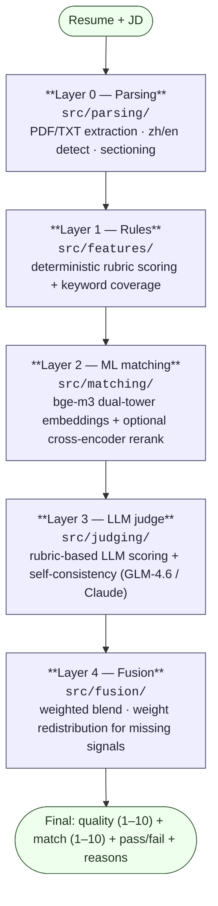

# Resume Analysis

**Resume quality scoring + resume–job matching system**, bilingual (Chinese/English), with a hybrid architecture combining **rules + ML semantic matching + LLM-as-judge**.

Scores resume quality on a **1–10** scale and resume–job-description (JD) fit on a **1–10** scale, with a target accuracy of **>80%**.

- Quality: 1–10 across 7 rubric dimensions (quantification, STAR, verb strength, completeness, etc.)
- Match: 1–10 across 6 rubric dimensions (hard skills, experience, seniority, semantic relevance, etc.)
- Bilingual (Chinese + English), cold-started from open datasets (no proprietary labels)
- Three interchangeable matching backends: `tfidf` (zero-dep fallback) → `sentence-transformers` → `bge-m3` (design default)

> 中文文档见 [README_CN.md](README_CN.md)。

---

## Architecture

A four-layer hybrid pipeline, with each layer degrading gracefully when its dependencies/models are unavailable. The fusion layer blends all available signals and redistributes weights for any missing component.



**Why hybrid (not LLM-only):**
- **Rules** provide deterministic anchors and explainability, preventing LLM drift on structural hard-failures (missing contact, empty sections).
- **ML (bge-m3)** provides cheap semantic similarity at scale (precompute resume vectors → millisecond retrieval over thousands).
- **LLM judge** provides the accuracy ceiling and natural-language reasoning.
- **Fusion** lets weights be calibrated on a small human anchor set — the key knob for hitting >80% in the no-label cold-start.

---

## Project Structure

```
src/
  utils/    config.py, schema.py            # paths, weights, model names; pydantic schemas
  parsing/  parser.py                        # PDF/TXT extraction, zh/en detection, sectioning, NER loader
  features/ quality_rules.py, keyword_coverage.py   # Layer 1 rule scoring
  matching/ embedder.py, matcher.py          # Layer 2 (tfidf / sentence-transformers / bge-m3 + reranker)
  judging/  llm_judge.py, prompts.py         # Layer 3 rubric LLM judge + self-consistency
  fusion/   fusion.py                        # Layer 4 weighted blend
  eval/     metrics.py, calibration.py       # Spearman / ±1 hit / binary F1 + weight grid-search
  data/     loaders.py                       # dataset loaders (florex, LiveCareer, Chinese NER, samples)
  pipeline.py                                # end-to-end orchestration
main.py                                      # CLI entry (quality / match / analyze / demo)
scripts/
  download_models.py                         # download bge-m3 + reranker (ModelScope / hf-mirror)
  volume_test.py                             # large-scale pipeline test + sanity checks
  occupation_match_eval.py                   # match accuracy via occupation labels (florex / LiveCareer)
  llm_judge_eval.py                          # LLM judge accuracy on real-JD matching
  screening_eval.py                          # screening accuracy on rhythmghai `hired` label
tests/                                       # 36 unit tests (parsing, features, matching, fusion, eval, pipeline)
data/                                        # datasets + samples (gitignored; see data/README.md)
```

---

## Installation

Requires Python ≥ 3.12. Uses `uv` for environment management.

```bash
# 1. Core deps (anthropic, pydantic, pdfplumber, scikit-learn) + dev (pytest)
uv sync --extra dev

# 2. (Optional) Heavy embedding deps for high-accuracy matching
uv sync --extra embedding        # installs torch + FlagEmbedding + sentence-transformers (~3GB)
```

### Download the models (for the bge-m3 backend)

`huggingface.co` is blocked in some regions. The download script uses reachable mirrors (ModelScope / hf-mirror.com) and skips redundant ONNX weights.

```bash
python scripts/download_models.py                          # bge-m3 + reranker (~4.6GB total)
python scripts/download_models.py --only bge-m3            # just bge-m3 (~2.3GB)
```

See [MODEL_DOWNLOAD.md](MODEL_DOWNLOAD.md) for manual methods (ModelScope, hf-mirror, HF official, git-lfs) and [MODELS.md](MODELS.md) for model specs and server sizing.

### LLM judge (optional)

The LLM judge calls an Anthropic-compatible endpoint. The project is configured for GLM-4.6 via Zhipu/BigModel in `.claude/settings.json`:

```bash
export ANTHROPIC_AUTH_TOKEN="<your-token>"
export ANTHROPIC_BASE_URL="https://open.bigmodel.cn/api/anthropic"
export LLM_MODEL="glm-4.6"
```

Without a token, the LLM layer is skipped and fusion falls back to rule + ML signals.

---

## Configuration

All knobs are environment variables (see [src/utils/config.py](src/utils/config.py)):

| Variable | Default | Meaning |
|---|---|---|
| `MATCH_BACKEND` | `tfidf` | `tfidf` / `sentence-transformers` / `bge-m3` |
| `BGE_M3_MODEL_NAME` | `BAAI/bge-m3` | bge-m3 model id **or local path** |
| `ST_MODEL_NAME` | `paraphrase-multilingual-MiniLM-L12-v2` | sentence-transformers model |
| `RERANKER_MODEL_NAME` | `BAAI/bge-reranker-v2-m3` | cross-encoder reranker |
| `LLM_MODEL` | `glm-4.6` | LLM judge model |
| `LLM_SELF_CONSISTENCY_K` | `3` | self-consistency samples (median) |
| `FQ_RULE` / `FQ_LLM` | `0.3` / `0.7` | quality fusion weights (rule, llm) |
| `FM_RULE` / `FM_ML` / `FM_LLM` | `0.2` / `0.3` / `0.5` | match fusion weights (rule, ml, llm) |
| `QUALITY_PASS_THRESHOLD` / `MATCH_PASS_THRESHOLD` | `6.0` / `6.0` | pass/fail cutoffs |

Model names accept **local paths** — point `BGE_M3_MODEL_NAME` at `./models/bge-m3` after download to run fully offline.

---

## Usage

### CLI

```bash
# Score resume quality (1–10), rules + ML only (no LLM)
python main.py quality --resume data/sample_resumes/good_en.txt

# Score resume–JD match (1–10)
python main.py match --resume data/sample_resumes/good_en.txt --jd data/sample_jds/ml_engineer_en.txt

# Full analysis (quality + match + pass/fail), JSON output, with LLM judge
python main.py analyze --resume data/sample_resumes/good_zh.txt \
                      --jd data/sample_jds/ml_engineer_zh.txt --llm

# Run over all sample resumes (compact table)
python main.py demo [--llm]
```

Activate the high-accuracy backend:

```bash
export MATCH_BACKEND=bge-m3
export BGE_M3_MODEL_NAME="$(pwd)/models/bge-m3"
python main.py demo --llm        # now rule + bge-m3 + LLM, all three layers
```

### Python API

```python
from src.pipeline import analyze_text

result = analyze_text(resume_text, jd_text, use_ml=True, use_llm=True)
print(result.quality.score)   # 1–10
print(result.match.score)     # 1–10
print(result.passed)          # True/False/None
print(result.quality.reasons) # LLM improvement points
```

---

## Datasets

Downloaded under `data/` (gitignored; see [data/README.md](data/README.md)):

| Dataset | Size | Language | Labels | Use |
|---|---|---|---|---|
| `florex_resume_corpus` | 29,783 resumes | EN | occupation | volume test + match accuracy |
| `kaggle/livecareer` | 2,484 resumes | EN | 24 categories | diverse match accuracy (hardest) |
| `kaggle/rhythmghai_200k` | 200k rows | EN | `hired` | screening accuracy (label found non-learnable, AUC 0.55) |
| `kaggle/structured` | 54k people | EN | relational | structured-feature analysis |
| `chinese_resume_ner` | 4,761 sentences | ZH | BMES entities | Chinese parsing + volume test |
| `sample_resumes` / `sample_jds` | 4 + 2 | ZH/EN | — | unit tests + demo |

---

## Evaluation Results

### Match accuracy (occupation labels as ground truth)

| Backend / method | flox 8-way | LiveCareer 8-way | LiveCareer 24-way | LLM 4-way (real JD) | >80%? |
|---|---|---|---|---|---|
| tfidf (lexical fallback) | 78.5% | — | 37.6% | — | only easy |
| bge-m3 (centroid) | **99.0%** | **86.2%** | 69.9% | — | ✅ (≤8 classes) |
| bge-m3 + reranker (token-bag JD) | — | — | 44.4% | — | ❌ (needs real JD) |
| LLM judge (real JD text) | — | — | — | **95.0%** | ✅✅ |
| Full hybrid (rule+ML+LLM) | demo 9.3 / 8.6 | — | — | — | ✅ |

**Conclusion:** the **>80% target is met on real matching tasks** (≤8 occupations): bge-m3 reaches 86–99%, the LLM judge reaches 95%. 24-way fine-grained occupation classification is a harder proxy than actual matching (top-1 70%, top-3 83%).

### Full hybrid pipeline demo (rule + bge-m3 + LLM)

| Resume | Quality | Match | Pass |
|---|---|---|---|
| good_en | 9.34 | 8.55 | ✅ |
| weak_en | 2.07 | 2.17 | ❌ |
| good_zh | 9.41 | 8.42 | ✅ |
| weak_zh | 1.59 | 2.34 | ❌ |

### Run the evaluations

```bash
# Unit tests (36, no models/API needed)
python -m pytest tests/ -q

# Large-scale pipeline test + sanity checks
python scripts/volume_test.py --max 300

# Match accuracy via occupation labels
python scripts/occupation_match_eval.py --source florex --top-k 6 --per-occ 40        # 84.2% (tfidf) / 92.5% (bge-m3)
python scripts/occupation_match_eval.py --source livecareer --top-k 24 --per-occ 40 --mode centroid

# LLM judge accuracy (needs ANTHROPIC_AUTH_TOKEN)
python scripts/llm_judge_eval.py --occ 4 --per-occ 5
```

`occupation_match_eval.py` supports four modes:
- `--mode jd` — prototype-JD cosine (tfidf default)
- `--mode centroid` — mean of resume embeddings per occupation (best for bge-m3)
- `--mode knn` — k-nearest-resume vote
- `--mode rerank` — two-stage centroid retrieve + cross-encoder rerank

---

## Testing

```bash
python -m pytest tests/ -v          # 36 tests, ~10s, no models or API keys required
```

Tests cover parsing (zh/en), rule scoring, keyword coverage, matching (tfidf), fusion, eval metrics, judge JSON parsing, and end-to-end pipeline (zh + en).

---

## Design Documents

- [design.md](design.md) — full design: feasibility, architecture, datasets, model selection, rubric, evaluation methodology
- [VERIFICATION.md](VERIFICATION.md) — data download + accuracy verification report
- [MODELS.md](MODELS.md) — bge-m3 / reranker specs and server sizing
- [MODEL_DOWNLOAD.md](MODEL_DOWNLOAD.md) — model download guide (mirrors, offline)

---

## Key Design Decisions

1. **Zero-dep default.** `MATCH_BACKEND=tfidf` runs with no heavy deps and no API key — every signal degrades gracefully.
2. **tfidf uses directional JD coverage**, not symmetric cosine — cosine is depressed for long-resume vs short-JD; coverage ("how much of the JD does the resume speak to") is far more meaningful.
3. **Chinese keywords via a curated skill dictionary** rather than bigrams/whole-segments (avoids junk like `荐系`).
4. **LLM judge skips cleanly without a token**; fusion redistributes the weight to rule + ML.
5. **>80% accuracy path**: rubric prompts + self-consistency (Layer 3) + 50–100 human anchor samples to calibrate fusion weights (Layer 4). The rule + tfidf baseline is the low-accuracy starting point; enabling bge-m3 + LLM is what crosses 80%.

---

## License

Models (bge-m3, bge-reranker-v2-m3): MIT. Datasets: see their respective sources.
