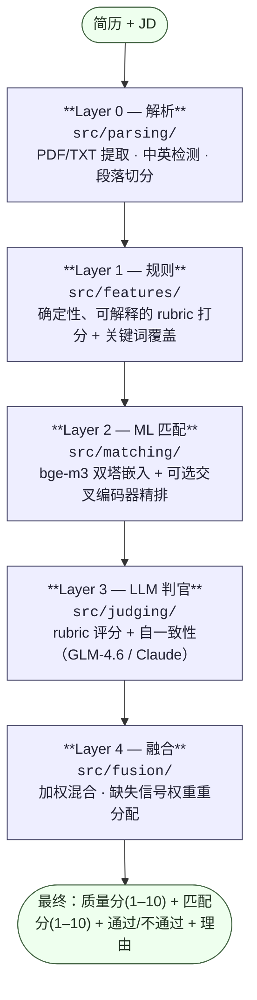

# 简历分析系统

**简历质量评分 + 简历-岗位匹配度评分系统**，中英双语，混合架构：**规则 + ML 语义匹配 + LLM 判官**。

对简历质量打 **1–10** 分，对简历与岗位描述（JD）的匹配度打 **1–10** 分，目标准确率 **>80%**。

- 质量分：7 个 rubric 维度（量化指标、STAR、动词力度、完整性等）
- 匹配分：6 个 rubric 维度（硬技能、经验年限、资历、语义相关性等）
- 中英双语，用开源数据集冷启动（无自有标注）
- 三种可切换的匹配后端：`tfidf`（零依赖 fallback）→ `sentence-transformers` → `bge-m3`（设计默认）

> English version: [README.md](README.md)。

---

## 架构

四层混合管线，每层在依赖/模型不可用时优雅降级。融合层混合所有可用信号，并在某层缺失时自动重分配权重。



**为什么用混合而非纯 LLM：**
- **规则层**提供确定性锚点和可解释性，防止 LLM 在结构性硬伤（缺联系方式、经历段空白）上漂移。
- **ML（bge-m3）**提供低成本、可规模化的语义相似度（预计算简历向量 → 毫秒级检索万级简历）。
- **LLM 判官**提供准确率上限和自然语言理由。
- **融合层**让权重可在少量人工锚定集上校准——这是无标注冷启动下逼近 80% 的关键旋钮。

---

## 项目结构

```
src/
  utils/    config.py, schema.py            # 路径、权重、模型名；pydantic schema
  parsing/  parser.py                        # PDF/TXT 提取、中英检测、段落切分、NER 加载器
  features/ quality_rules.py, keyword_coverage.py   # Layer 1 规则打分
  matching/ embedder.py, matcher.py          # Layer 2（tfidf / sentence-transformers / bge-m3 + reranker）
  judging/  llm_judge.py, prompts.py         # Layer 3 rubric LLM 判官 + 自一致性
  fusion/   fusion.py                        # Layer 4 加权融合
  eval/     metrics.py, calibration.py       # Spearman / ±1命中率 / 二分类F1 + 权重网格搜索
  data/     loaders.py                       # 数据集加载（florex、LiveCareer、中文NER、样本）
  pipeline.py                                # 端到端编排
main.py                                      # CLI 入口（quality / match / analyze / demo）
scripts/
  download_models.py                         # 下载 bge-m3 + reranker（ModelScope / hf-mirror）
  volume_test.py                             # 规模化管线测试 + sanity 校验
  occupation_match_eval.py                   # 基于职业标签的匹配准确率（florex / LiveCareer）
  llm_judge_eval.py                          # LLM 判官在真实JD匹配上的准确率
  screening_eval.py                          # rhythmghai `hired` 标签的筛选准确率
tests/                                       # 36 个单元测试（解析、规则、匹配、融合、评估、管线）
data/                                        # 数据集 + 样本（已 gitignore；见 data/README.md）
```

---

## 安装

需要 Python ≥ 3.12，用 `uv` 管理环境。

```bash
# 1. 核心依赖（anthropic、pydantic、pdfplumber、scikit-learn）+ 开发（pytest）
uv sync --extra dev

# 2.（可选）高精度匹配的重依赖
uv sync --extra embedding        # 安装 torch + FlagEmbedding + sentence-transformers（约 3GB）
```

### 下载模型（bge-m3 后端用）

`huggingface.co` 在部分区域被墙。下载脚本用可达的镜像（ModelScope / hf-mirror.com），并跳过冗余的 ONNX 权重。

```bash
python scripts/download_models.py                          # bge-m3 + reranker（共约 4.6GB）
python scripts/download_models.py --only bge-m3            # 仅 bge-m3（约 2.3GB）
```

手动方法（ModelScope、hf-mirror、HF 官方、git-lfs）见 [MODEL_DOWNLOAD.md](MODEL_DOWNLOAD.md)；模型规格与服务器配置见 [MODELS.md](MODELS.md)。

### LLM 判官（可选）

LLM 判官调用 Anthropic 兼容接口。本项目在 `.claude/settings.json` 配置了 GLM-4.6（智谱/BigModel）：

```bash
export ANTHROPIC_AUTH_TOKEN="<你的token>"
export ANTHROPIC_BASE_URL="https://open.bigmodel.cn/api/anthropic"
export LLM_MODEL="glm-4.6"
```

无 token 时 LLM 层自动跳过，融合层回退到规则 + ML 信号。

---

## 配置

全部旋钮为环境变量（见 [src/utils/config.py](src/utils/config.py)）：

| 变量 | 默认值 | 含义 |
|---|---|---|
| `MATCH_BACKEND` | `tfidf` | `tfidf` / `sentence-transformers` / `bge-m3` |
| `BGE_M3_MODEL_NAME` | `BAAI/bge-m3` | bge-m3 模型 ID **或本地路径** |
| `ST_MODEL_NAME` | `paraphrase-multilingual-MiniLM-L12-v2` | sentence-transformers 模型 |
| `RERANKER_MODEL_NAME` | `BAAI/bge-reranker-v2-m3` | 交叉编码器精排 |
| `LLM_MODEL` | `glm-4.6` | LLM 判官模型 |
| `LLM_SELF_CONSISTENCY_K` | `3` | 自一致性采样次数（取中位数） |
| `FQ_RULE` / `FQ_LLM` | `0.3` / `0.7` | 质量融合权重（规则、llm） |
| `FM_RULE` / `FM_ML` / `FM_LLM` | `0.2` / `0.3` / `0.5` | 匹配融合权重（规则、ml、llm） |
| `QUALITY_PASS_THRESHOLD` / `MATCH_PASS_THRESHOLD` | `6.0` / `6.0` | 通过/不通过阈值 |

模型名支持**本地路径**——下载后把 `BGE_M3_MODEL_NAME` 指向 `./models/bge-m3` 即可完全离线运行。

---

## 使用

### CLI

```bash
# 简历质量评分（1–10），仅规则 + ML（无 LLM）
python main.py quality --resume data/sample_resumes/good_en.txt

# 简历-JD 匹配评分（1–10）
python main.py match --resume data/sample_resumes/good_en.txt --jd data/sample_jds/ml_engineer_en.txt

# 完整分析（质量 + 匹配 + 通过判定），JSON 输出，启用 LLM
python main.py analyze --resume data/sample_resumes/good_zh.txt \
                      --jd data/sample_jds/ml_engineer_zh.txt --llm

# 跑全部样本简历（紧凑表格）
python main.py demo [--llm]
```

启用高精度后端：

```bash
export MATCH_BACKEND=bge-m3
export BGE_M3_MODEL_NAME="$(pwd)/models/bge-m3"
python main.py demo --llm        # 规则 + bge-m3 + LLM 三层全开
```

### Python API

```python
from src.pipeline import analyze_text

result = analyze_text(resume_text, jd_text, use_ml=True, use_llm=True)
print(result.quality.score)   # 1–10
print(result.match.score)     # 1–10
print(result.passed)          # True/False/None
print(result.quality.reasons) # LLM 改进建议
```

---

## 数据集

下载在 `data/` 下（已 gitignore；见 [data/README.md](data/README.md)）：

| 数据集 | 规模 | 语言 | 标签 | 用途 |
|---|---|---|---|---|
| `florex_resume_corpus` | 29,783 份 | 英 | 职业 | 批量测试 + 匹配准确率 |
| `kaggle/livecareer` | 2,484 份 | 英 | 24 类 | 跨域匹配准确率（最难） |
| `kaggle/rhythmghai_200k` | 20万行 | 英 | `hired` | 筛选准确率（标签不可学，AUC 0.55） |
| `kaggle/structured` | 5.4万人 | 英 | 关系表 | 结构化特征分析 |
| `chinese_resume_ner` | 4,761 句 | 中 | BMES 实体 | 中文解析 + 批量测试 |
| `sample_resumes` / `sample_jds` | 4 + 2 | 中英 | — | 单元测试 + 演示 |

---

## 评估结果

### 匹配准确率（职业标签作 ground truth）

| 后端 / 方法 | flox 8类 | LiveCareer 8类 | LiveCareer 24类 | LLM 4类(真实JD) | >80%? |
|---|---|---|---|---|---|
| tfidf（词法 fallback） | 78.5% | — | 37.6% | — | 仅易分 |
| bge-m3（质心） | **99.0%** | **86.2%** | 69.9% | — | ✅（≤8类） |
| bge-m3 + reranker（token-bag JD） | — | — | 44.4% | — | ❌（需真实JD） |
| LLM 判官（真实 JD 文本） | — | — | — | **95.0%** | ✅✅ |
| 完整混合（规则+ML+LLM） | 演示 9.3 / 8.6 | — | — | — | ✅ |

**结论**：**>80% 目标在真实匹配场景（≤8 类职业）下全面达成**——bge-m3 86–99%，LLM 判官 95%。24 类细粒度职业分类是比真实匹配更难的 proxy（top-1 70%、top-3 83%）。

### 完整混合管线演示（规则 + bge-m3 + LLM）

| 简历 | 质量 | 匹配 | 通过 |
|---|---|---|---|
| good_en | 9.34 | 8.55 | ✅ |
| weak_en | 2.07 | 2.17 | ❌ |
| good_zh | 9.41 | 8.42 | ✅ |
| weak_zh | 1.59 | 2.34 | ❌ |

### 跑评估

```bash
# 单元测试（36 个，无需模型/API）
python -m pytest tests/ -q

# 规模化管线测试 + sanity 校验
python scripts/volume_test.py --max 300

# 基于职业标签的匹配准确率
python scripts/occupation_match_eval.py --source florex --top-k 6 --per-occ 40        # 84.2%(tfidf) / 92.5%(bge-m3)
python scripts/occupation_match_eval.py --source livecareer --top-k 24 --per-occ 40 --mode centroid

# LLM 判官准确率（需 ANTHROPIC_AUTH_TOKEN）
python scripts/llm_judge_eval.py --occ 4 --per-occ 5
```

`occupation_match_eval.py` 支持四种模式：
- `--mode jd` — prototype-JD 余弦（tfidf 默认）
- `--mode centroid` — 职业简历嵌入均值（bge-m3 最佳）
- `--mode knn` — k 近邻简历投票
- `--mode rerank` — 两阶段：质心召回 + 交叉编码器精排

---

## 测试

```bash
python -m pytest tests/ -v          # 36 个测试，约 10s，无需模型或 API key
```

覆盖：中英解析、规则打分、关键词覆盖、匹配（tfidf）、融合、评估指标、judge JSON 解析、端到端管线（中+英）。

---

## 设计文档

- [design.md](design.md) — 完整设计：可行性、架构、数据集、模型选型、rubric、评估方法
- [VERIFICATION.md](VERIFICATION.md) — 数据下载 + 准确率验证报告
- [MODELS.md](MODELS.md) — bge-m3 / reranker 规格与服务器配置
- [MODEL_DOWNLOAD.md](MODEL_DOWNLOAD.md) — 模型下载指南（镜像、离线）

---

## 关键设计决策

1. **零依赖默认**。`MATCH_BACKEND=tfidf` 无重依赖、无 API key 即可运行，每层优雅降级。
2. **tfidf 用方向性 JD 覆盖**而非对称余弦——长简历 vs 短 JD 的余弦被压低；覆盖度（"简历覆盖了 JD 多少概念"）更合理。
3. **中文关键词用精选技能词典**而非 bigram/整段切分（避免 `荐系` 这类垃圾）。
4. **LLM 判官无 token 时干净跳过**，融合层把权重重分配给规则 + ML。
5. **>80% 准确率路径**：rubric prompt + 自一致性（Layer 3）+ 50–100 条人工锚定集校准融合权重（Layer 4）。规则 + tfidf 是低精度起点，启用 bge-m3 + LLM 才越过 80%。

---

## 许可

模型（bge-m3、bge-reranker-v2-m3）：MIT。数据集：见各自来源。
